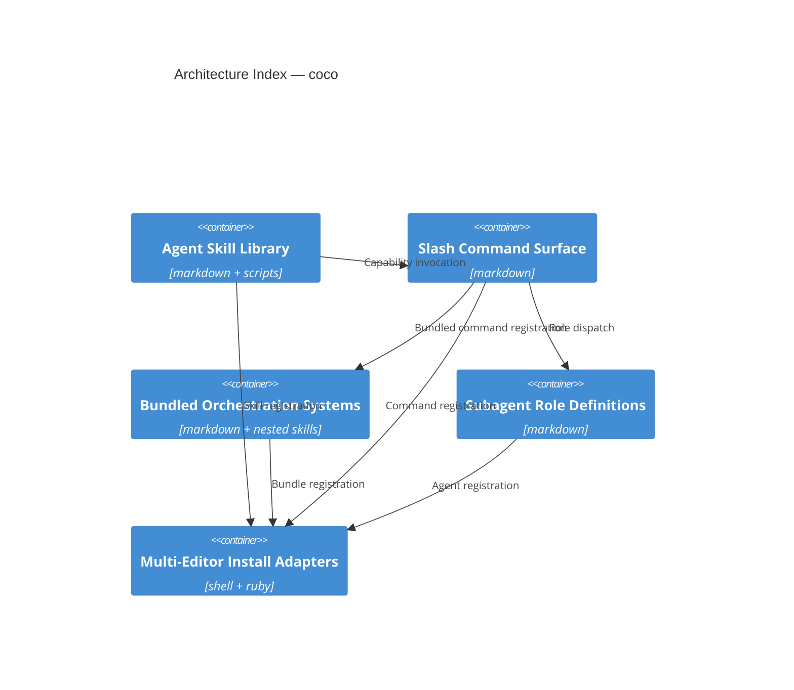

# Architecture Index — coco

**Pinned at:** e5c673f (2026-07-31) · **Validator:** exit 0, 10 paths verified
**Source:** gitnexus code graph, 22 commits behind at read time · **Altitude:** C4-Container

Structural index only. Component paths describe where code lives; they are not
work-assignment boundaries, and a single component may legitimately own more than a
thousand files — `systems/` and `skills/` each do. Drift detection covers structural
change only: a component reworked entirely inside its own already-claimed directory
produces no drift. See `team:architecture.md` for the protocol and its stated limits.

| Component | Purpose | Primary paths |
|---|---|---|
| Agent Skill Library | Reusable agent capabilities as self-contained skill directories, each with a SKILL.md manifest | `skills/` |
| Slash Command Surface | Namespaced slash commands, including the `/team` four-layer orchestration router | `commands/` |
| Bundled Orchestration Systems | Optional bundles shipping their own nested skills and agents, installable independently | `systems/` |
| Subagent Role Definitions | Named subagent roles that commands dispatch to, plus the behavioural rules they load | `agents/`, `rules/` |
| Multi-Editor Install Adapters | Per-editor symlink installation across Claude Code, Cursor, and Codex, plus a Homebrew formula | `adapters/`, `bin/`, `Formula/`, `install.sh` |

`skills/` additionally shares `templates/` with the command surface.

## Deliberately unclaimed

Under the runtime-only rule in `skills/arch-index/references/component-rules.md`, these
are not components and belong to none: `scripts/` and `docs/` (build tooling and the
catalogs it generates), `.github/` and `workflows/` (continuous integration), `tests/`,
`examples/`, and `assets/`. They are real and they matter; they are not part of the
runtime an agent consumes.

## Diagram



Render with `design:mermaid` (beautiful-mermaid), never the standard Mermaid CDN.

## Regenerating

This file is derived from `.arch/index.json` and is rewritten on every build. Edit the
JSON, never this file; if the two disagree, the JSON wins.

```bash
python3 skills/arch-index/scripts/validate_index.py .arch/index.json --repo-root .
python3 skills/arch-index/scripts/arch_drift.py --repo-root .
```
