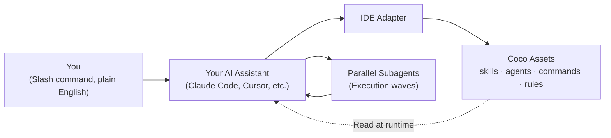

<div align="center">

<br>


# Meet Coco.

### A superintelligent agent framework powered by an advisory board of 389 world-class minds. Scale your AI assistant into a complete engineering department.
Free | MIT License | 90-Second Onboarding

<br>

[](https://opensource.org/license/mit)
[](CHANGELOG.md)
[](skills/)
[](commands/)
[](systems/superintelligence/)
[](https://github.com/rkz91/coco/actions)

<br>

<p>
&nbsp;&nbsp;<a href="#install"><kbd> &nbsp; Install &nbsp; </kbd></a>&nbsp;&nbsp;
<a href="#core-feature-coco-superintelligence"><kbd> &nbsp; Superintelligence &nbsp; </kbd></a>&nbsp;&nbsp;
<a href="#three-pillars"><kbd> &nbsp; Core Architecture &nbsp; </kbd></a>&nbsp;&nbsp;
<a href="#skills-catalog-deep-dive"><kbd> &nbsp; Skills &nbsp; </kbd></a>&nbsp;&nbsp;
<a href="#system-bundles-deep-dive"><kbd> &nbsp; Systems &nbsp; </kbd></a>&nbsp;&nbsp;
<a href="#see-it-run"><kbd> &nbsp; Demos &nbsp; </kbd></a>
</p>

<br>

</div>

---

<div align="center">

> **One developer writing single prompts? That was last year.**
>
> Coco turns your AI coding session into an entire engineering department. It spawns specialized agents, runs parallel code tasks, coordinates complex review panels, persists phase state across resets, and enforces deterministic verification gates before code is committed.

</div>

```bash
git clone https://github.com/rkz91/coco.git && cd coco && bash install.sh
```

<div align="center"><sub>90 seconds. That's all it takes to wire Coco's workspace engine into your IDE.</sub></div>

---

## Core Feature: Coco Superintelligence

### A Cross-Team Advisory Board of 389 World-Class Minds

Coco's signature differentiator is Superintelligence. It allows you to summon custom, real-world expert panels directly inside your coding sessions to guide architectural, engineering, risk, finance, and business decisions:

```bash
/SI-Decide "Should we migrate our database to pgvector?"
/SI-AI-Decide "Which embedding model gives the best cost/performance?"
/SI-Eng-Pre-Mortem "Review our zero-downtime cache migration strategy"
/SI-GRC-Review "Check this customer onboarding flow for GDPR compliance"
```

*   **389 Expert Personas**: Organized across 9 specialized departments:
    *   **Engineering** (70 experts): Experts in software architecture, cloud systems, systems coding, compilers, and infrastructure.
    *   **AI** (59 experts): Neural network research, LLM optimization, safety, alignment, and vector database engineering.
    *   **Product and Design** (56 experts): Design systems, UX design, product strategy, and growth loops.
    *   **Finance** (47 experts): Valuation, corporate finance, macroeconomic modeling, and fintech infrastructure.
    *   **Trading** (46 experts): Quantitative analysis, market microstructure, derivatives pricing, and crypto liquidity.
    *   **Risk and Compliance / GRC** (30 experts): GDPR, HIPAA, SOC2 compliance, security auditing, and international regulations.
    *   **Strategy** (29 experts): Platform economics, business models, competitive analysis, and strategic growth.
    *   **Data and Analytics** (29 experts): Data engineering, pipeline optimization, predictive modeling, and analytics stacks.
    *   **Sales / GTM / Marketing** (23 experts): Product-market fit, sales operations, growth marketing, and enterprise GTM.
*   **242 Generated Slash Commands**: Comprises 17 Cross-Team Meta Commands (like `/SI-Decide` or `/SI-Tradeoff` routing across multiple domains) and 225 Per-Team Commands (25 per team, such as `/SI-AI-Decide` or `/SI-Eng-Pre-Mortem`).
*   **Cross-Team Meta-Orchestration**: For complex queries spanning domains ("build and sell an AI audit tool"), a Stage-A local router uses nomic-embed to score the prompt against team registries and cells, greedily picking a proportional 16-32 person panel.
*   **Citable and Grounded**: Every stance is verified from public sources and carries a direct evidence URL. Personas are validated against a strict anti-fabrication gate.

### The Selection Algorithm (Two-Stage Routing + Approval)

The Meta-Orchestrator uses a staged algorithm to avoid loading massive file systems at runtime — two routing stages (team/cell, then scoped personas) followed by an approval-and-execution step:

1.  **Stage A: Team and Cell Routing (Cheap)**: Reads the meta-registry (`superintelligence/registry.json`) and scans only the team descriptions and cell definitions. It scores team relevance using keyword and domain overlap, selecting the top 1-4 teams. If a single team dominates, it delegates to that team's normal orchestrator.
2.  **Stage B: Scoped Persona Selection (Scoped)**: Loads compact persona records (slugs, cells, domains, stances, conflict mappings) for only the selected teams. It allocates the 16-32 panel budget proportionally to team relevance, runs the greedy scorer (`0.40·domain + 0.30·cell-coverage + 0.30·conflict-pairing`), and applies a cross-team tension pass to pair opposing viewpoints (e.g., security vs. growth).
3.  **Stage C: Approval and Execution**: Presents the roster grouped by team with a one-line selection rationale. The executing action verb consumes the approved roster, and the resulting output includes full line-by-line attribution (e.g., "Aswath Damodaran (Finance): ...").

### Persona Build and Validation Pipeline

The 389-persona roster was compiled using a systematic multi-tier workflow:
- **Generation**: Evaluated Local Qwen 3.6 (via LM Studio) -> GPT-5-Nano (via QB Gateway) -> Gemini 3.5 Flash -> Claude Research Agents (web search). Claude research agents proved to be the quality winner for resolving historical data and cited Signal.
- **Validation Gate**: Run via `validate_persona.py`, enforcing that every persona must have at least 4 live, non-404 cited evidence URLs, a valid home team, no fabricated quotes, and at least 2 verified signals within the last 12 months (or archetype persistent signals for historical figures).

---

## The Coco Asset Library

A standard installation equips your workspace with a lightweight set of tools, while full activation unlocks up to 860 total assets to orchestrate any software engineering workflow:

<table align="center">
<tr>
<td align="center" width="20%"><h3>142</h3><sub>Skills</sub><br><small>59 Core + 83 Bundle</small></td>
<td align="center" width="20%"><h3>277</h3><sub>Slash Commands</sub><br><small>35 Core + 242 Bundle</small></td>
<td align="center" width="20%"><h3>34</h3><sub>Specialized Agents</sub><br><small>10 Core + 24 Bundle</small></td>
<td align="center" width="20%"><h3>389</h3><sub>Expert Personas</sub><br><small>Superintelligence Board</small></td>
<td align="center" width="20%"><h3>15</h3><sub>Cross-IDE Rules</sub><br><small>Cursor MDC Rules</small></td>
</tr>
</table>

<div align="center">
  <sub><strong>Core Installation:</strong> 119 active assets (59 Skills, 35 Commands, 10 Agents, 15 Rules)</sub><br>
  <sub><strong>Orchestration Bundles:</strong> <strong>+68 GSD skills</strong> · <strong>+24 GSD agents</strong> · <strong>+6 Brain skills</strong> · <strong>+9 Superintelligence skills</strong> · <strong>+242 SI commands</strong> · <strong>3 Workflows</strong></sub>
</div>

---

## Three Pillars of Coco

<table>
<tr>
<td width="33%" valign="top">

### 1. Autonomous Team Execution
`/team:ship` initiates a fully coordinated build pipeline consisting of 6 development stages and 7 hard verification gates. Specialized agents act in their specific domains (Research, Architecture, Plan, Review, Build, QA). Crucially, code changes must clear the Test Evidence Protocol (independent re-runs, strict coverage metrics, and skip-prevention) before opening a pull request.

</td>
<td width="33%" valign="top">

### 2. Disk-Persistent State
AI chat contexts are fragile and wipe on `/clear`. Coco solves this with 68 disk-backed orchestration skills that persist phase state, decisions, and progress logs across resets. Includes atomic git commits for every successful step, allowing you to review history, roll back bad design paths, or resume long-running migrations from any checkpoint.

</td>
<td width="33%" valign="top">

### 3. Vendor-Neutral Portability
Coco compiles its rules, templates, and agent definitions into pure Markdown and YAML frontmatter. Using native IDE adapters, the same skill library is injected into Claude Code, Cursor, Codex CLI, or any AGENTS.md compatible environment. Keep your workflows, scripts, and commands even if you switch your AI editor in the future.

</td>
</tr>
</table>

---

## Skills Catalog Deep-Dive

Coco comes loaded with 142 skills. These are not basic prompt templates, but fully realized agent instructions containing state management, verification logic, and error handlers:

### Visual Design and Styling Systems
*   **ui-ux-pro-max**: Generates modern visual presets containing 50+ styling tokens, 21 color palettes, font pairings, and responsive charts.
*   **axiom-liquid-glass**: Implements high-end glassmorphism visual styling specifications using HSL tailored colors, backdrop filters, and subtle border shadows.
*   **swiftui-liquid-glass**: Tailors the visual glassmorphic design system specifically for Apple SwiftUI layouts.
*   **web-design-guidelines**: Enforces strict layout grids, typography scales, responsive query setups, and color harmony constraints.
*   **tailwind-patterns**: A library of production-ready, accessible Tailwind CSS layout patterns (navigation, tables, carousels, cards).

### Enterprise Engineering and Architecture
*   **c4-architecture**: Guides the creation of system architecture diagrams following the C4 model (Context, Container, Component, Code).
*   **api-design-principles**: Enforces RESTful and gRPC API standards, focusing on clean resource naming, status code mappings, and error shapes.
*   **arb-review**: Prepares codebases and designs for Architecture Review Board audits, assessing scalability, security, and portability.
*   **vercel-react-best-practices**: Enforces Next.js App Router rules, React Server Components boundaries, and optimized hook placement.
*   **subagent-driven-development**: Instructs the primary AI on how to delegate complex engineering tasks to sandboxed, specialized subagents.

### Document and Spreadsheet Processing
*   **xlsx**: Creates and formats data-dense Excel spreadsheets locally using Python openpyxl scripts.
*   **pdf**: Generates structured PDFs (reports, specs, invoices) with custom tables and headers.
*   **docx**: Assembles word documents with standard paragraph, heading, and table styling.
*   **doc-sync**: Automates synchronization between code implementations and project documentation (PRDs, readmes, APIs).

### Operations, Safety, and Disaster Recovery
*   **dr-plan**: Generates disaster recovery specifications containing RTO/RPO targets, failover steps, and data integrity verification.
*   **recovery-plan**: Formulates active incident response plans to restore services after database corruption or server failure.
*   **using-git-worktrees**: Sets up parallel, isolated development branches on the local disk using git worktrees.
*   **finishing-a-development-branch**: Automates the PR prep process: cleans local branch, squashes commits, runs lint, updates changelogs, and opens PR.

### Product Management and Communication
*   **prd-mastery**: Generates deep Product Requirement Documents containing user stories, scope limits, metrics, and risk mitigations.
*   **stakeholder-comms**: Generates clear, non-technical progress summaries and release notes tailored to stakeholders.
*   **nfr-tracker**: Audits and tracks Non-Functional Requirements (latency, cost, throughput, security) against defined SLAs.
*   **brainstorming**: Conducts structured brainstorming sessions (SCAMPER, First Principles, Mind Mapping) and outputs formatted markdown tables.

---

## System Bundles Deep-Dive

System bundles are opt-in packages that extend the workspace engine with specialized databases, pipelines, and persona rosters:

### 1. GSD (Get Shit Done) Bundle
An orchestration engine consisting of **68 skills and 24 agents** that manages the lifecycle of complex codebases.
*   **State Database**: Uses a disk-backed JSON/YAML phase database that records active goals, decisions, milestones, and blockages.
*   **Workstreams**: Spins up parallel workspaces (isolated git checkouts) to test refactors or debug features in sandbox environments without polluting main.
*   **Forensics**: Performs post-mortem audits when a phase fails. Scans commit histories, state files, and agent logs to generate structured root-cause reports.
*   **Autonomous Mode**: Bypasses confirmation steps, allowing parallel waves of subagents to execute plan milestones end-to-end.

### 2. Brain Bundle
A local knowledge graph engine consisting of **6 skills** that connects email, chat, code, and documentation.
*   **Local SQLite Store**: Indexes code entities (classes, components), business decisions, project terms, and stakeholder feedback.
*   **Wiki Generator**: Automatically builds local, hyperlinked wiki articles for every recorded entity in the project.
*   **Mail Sync**: Ingests and links project email threads directly to related code files.

### 3. Team Bundle
A workspace multi-agent pipeline engine.
*   **Development Loop**: Spawns specialized subagents (Research, Architect, QA) to execute changes, review diffs, and write unit tests.
*   **Deterministic Gates**: Intercepts merges and commits to run lints, import audits, reference checks, and verification suites.

---

## YOLO Mode: True Autonomy

<table>
<tr>
<td valign="top">

```bash
/coco yolo
```

</td>
<td valign="top">

**Bypass approval gates and let the team run unattended.**<br>
<sub>Activates autonomous multi-stage execution. Pipelines transition from phase to phase without requesting manual user confirmations. Combine with <code>/gsd-autonomous</code> and <code>--systems gsd</code> to run code migrations or test sweeps overnight. Easily revert to safety using <code>/coco careful</code> or <code>/coco normal</code>.</sub>

</td>
</tr>
</table>

---

## Before Coco vs. After Coco

<table>
<tr>
<th width="20%">Scenario</th>
<th width="38%">Standard AI Assistant (Claude Code / Cursor / Codex)</th>
<th width="42%">Coco-Orchestrated Workspace</th>
</tr>
<tr>
<td><strong>Feature Development</strong></td>
<td>Generates a single component, misses side-effects, requires manual guidance.</td>
<td>Scans repo, designs interface, plans phases, executes parallel build agents, tests, and verifies.</td>
</tr>
<tr>
<td><strong>Code Auditing</strong></td>
<td>Suggests basic syntax fixes; misses architectural constraints.</td>
<td>Applies a 7-category audit (TDZ errors, import mismatches, dead code, CSS regressions, and mock leaks).</td>
</tr>
<tr>
<td><strong>System Debugging</strong></td>
<td>Repeats similar suggestions; loses track of prior attempts.</td>
<td>Systematic isolation loop (Reproduce → Isolate → Hypothesize → Fix → Verify) with saved checkpoints.</td>
</tr>
<tr>
<td><strong>Website Cloning</strong></td>
<td>Outputs a generic layout with broken assets.</td>
<td>Extracts exact design tokens (colors, radii, spacing, type scale) into a production-ready template.</td>
</tr>
<tr>
<td><strong>Context Resets</strong></td>
<td>Forgets active plan; starts over from scratch.</td>
<td>Reads workspace state from disk and resumes the active phase immediately.</td>
</tr>
</table>

---

## High-Impact Command Demos

<table>
<tr>
<td width="50%" valign="top">

### Website Re-engineering
```bash
/clone-website https://stripe.com
```
> Extracts colors, typography, spacing, shadows, and SVG assets directly from a live URL into a single-file, responsive HTML template.

</td>
<td width="50%" valign="top">

### Code-Integrity Verification
```bash
/code-verification
```
> Audits fresh code against 7 bug vectors before execution, preventing broken references, imports, and mock leakage.

</td>
</tr>
<tr>
<td valign="top">

### Systematic Debugging
```bash
/systematic-debugging
```
> Drives a methodical root-cause isolation workflow. Records hypotheses and findings, preserving progress across API limits.

</td>
<td valign="top">

### Spec & PRD Generation
```bash
/prd-generator
```
> Generates a comprehensive, 13-section Product Requirement Document (User Stories, Metrics, Risks, Architecture).

</td>
</tr>
<tr>
<td valign="top">

### Design Token Extraction
```bash
/ui-ux-pro-max
```
> Generates visual presets: 50+ modern styling tokens, 21 color palettes, font pairings, and charts configured for your stack.

</td>
<td valign="top">

### Personal Knowledge Base
```bash
bash install.sh --systems brain
/brain-init && /brain-update
```
> Builds a local, SQLite-backed entity graph of your project. Automatically indexes decisions, terms, and file relations.

</td>
</tr>
</table>

---

## Power Features Overview

<table>
<tr>
<td width="50%" valign="top">

### CoCo Conversational Router
```bash
/coco
```
> A central dashboard that automatically routes queries like "what's blocking?", "summarize files," or "run tests" to the correct sub-command.

</td>
<td width="50%" valign="top">

### Multimodal Memory
```bash
/media-memory
```
> Local embedding database (Gemini Embedding + ChromaDB) that indexes, searches, and associates diagrams, audio, and docs with your code.

</td>
</tr>
<tr>
<td valign="top">

### Scheduled & Loop Agents
```bash
# Host-native scheduling (e.g. Claude Code) pointed at any Coco command:
/schedule run /team:review every Monday
/loop 5m /team:verify
```
> Coco does not ship its own scheduler. Where your host CLI provides scheduling or looping (such as Claude Code's `/schedule` and `/loop`), point it at any Coco command — `/team:review`, `/team:verify`, `/code-verification` — to run reviews or watches unattended.

</td>
<td valign="top">

### Email Triage Suite
```bash
/email:summary
/email:today
```
> Reads your active Outlook instance (Legacy AppleScript or New Outlook MIME cache) to fetch, search, thread, and draft replies to project mail.

</td>
</tr>
<tr>
<td valign="top">

### Workspace Branching
```bash
/gsd-workstreams create feature-a
/gsd-new-workspace
```
> Branch development workstreams within the same repository. Spin up isolated, sandboxed clones with separate project state.

</td>
<td valign="top">

### AGENTS.md Compiler
```bash
bash adapters/codex/install.sh
```
> Compiles all active rules, skills, and command definitions into a standard `AGENTS.md` file recognized by Aider, Cline, and Continue.

</td>
</tr>
</table>

---

## How Coco Works



---

## Installation Matrix

<table>
<tr>
<td width="50%" valign="top">

**Standard 90-Second Setup**

```bash
git clone https://github.com/rkz91/coco.git
cd coco
bash install.sh
```
*Installer will auto-detect your active IDE/CLI.*

</td>
<td width="50%" valign="top">

**Via Global npm Package**

```bash
# Authenticate GitHub Packages registry
echo "@rkz91:registry=https://npm.pkg.github.com" >> ~/.npmrc
echo "//npm.pkg.github.com/:_authToken=YOUR_TOKEN" >> ~/.npmrc

# Install and launch
npm install -g @rkz91/coco-cli
coco
```

</td>
</tr>
<tr>
<td valign="top">

**Activate Orchestration Bundles**

```bash
# Enable GSD, Brain, and Team systems
bash install.sh --systems gsd,brain,team

# Enable Superintelligence personas
bash install.sh --systems superintelligence
```

</td>
<td valign="top">

**Manual Adapter Overrides**

```bash
bash install.sh --adapter claude-code
bash install.sh --adapter cursor
bash install.sh --adapter codex
bash install.sh --adapter generic
```

</td>
</tr>
</table>

---

## Staying Current

Coco tells you when a newer version is available — it checks the GitHub repository (the source) at most once per day, prints a one-line banner, and sends **no telemetry**. Disable with `COCO_NO_UPDATE_CHECK=1`.

<table>
<tr>
<td width="50%" valign="top">

**git clones**

```bash
# print version + update status
bash scripts/check-update.sh

# apply an update
git pull --ff-only && bash install.sh
```

</td>
<td width="50%" valign="top">

**npm installs**

```bash
# print version + check for updates
npx @rkz91/coco-cli version

# apply an update
npx @rkz91/coco-cli update
```

</td>
</tr>
</table>

<sub>Releases are tracked in [`CHANGELOG.md`](CHANGELOG.md) and on the <a href="https://github.com/rkz91/coco/releases">GitHub Releases</a> page.</sub>

---

## System Compatibility

<table>
<tr>
<th>AI Tool / CLI</th>
<th>Adapter Name</th>
<th>Status</th>
<th>Details</th>
</tr>
<tr>
<td><strong><a href="https://docs.anthropic.com/en/docs/claude-code">Claude Code</a></strong></td>
<td><code>claude-code</code></td>
<td>Stable</td>
<td>Full support for slash commands, agents, and local settings.</td>
</tr>
<tr>
<td><strong><a href="https://cursor.com/">Cursor</a></strong></td>
<td><code>cursor</code></td>
<td>Stable</td>
<td>Links MDC rules and custom workspace skills.</td>
</tr>
<tr>
<td><strong><a href="https://github.com/openai/codex">Codex CLI</a></strong></td>
<td><code>codex</code></td>
<td>Stable</td>
<td>Compiles assets into root context.</td>
</tr>
<tr>
<td><strong>Aider / Cline / Windsurf</strong></td>
<td><code>generic</code></td>
<td>Stable</td>
<td>Generates a portable, root-level <code>AGENTS.md</code> definition.</td>
</tr>
<tr>
<td><strong>VS Code (Continue)</strong></td>
<td><code>vscode-continue</code></td>
<td>Experimental (stub)</td>
<td>Scaffold only — full wiring tracked in <a href="https://github.com/rkz91/coco/issues/4">#4</a>, targeted for v0.2.</td>
</tr>
<tr>
<td><strong>Antigravity (Google)</strong></td>
<td><code>antigravity</code></td>
<td>Planned</td>
<td>Integration planned for v0.2 release.</td>
</tr>
</table>

---

## Technical Specifications

<table>
<tr><td><strong>Spec Version</strong></td><td>1.0.0</td></tr>
<tr><td><strong>License</strong></td><td><a href="https://opensource.org/license/mit">MIT</a></td></tr>
<tr><td><strong>Total Skills Available</strong></td><td>142 with all bundles installed (59 Core + 68 GSD + 6 Brain + 9 Superintelligence)</td></tr>
<tr><td><strong>Slash Commands</strong></td><td>277 with all bundles installed — 35 Core (shipped) + 242 Superintelligence (225 per-team + 17 cross-team, generated at install of the Superintelligence bundle)</td></tr>
<tr><td><strong>Specialized Agents</strong></td><td>34 (10 Core + 24 GSD Bundle)</td></tr>
<tr><td><strong>System Bundles</strong></td><td>4 (GSD, Brain, Team, Superintelligence) — opt in with <code>--systems &lt;name&gt;</code></td></tr>
<tr><td><strong>Cross-IDE Rules</strong></td><td>15 (.mdc files)</td></tr>
<tr><td><strong>Workflows Defined</strong></td><td>3 (.md pipelines)</td></tr>
<tr><td><strong>Install Time</strong></td><td>&le; 90 seconds</td></tr>
<tr><td><strong>Telemetry / SaaS</strong></td><td>None — 100% Local Files</td></tr>
</table>

<sub>Core install ships 59 skills + 35 commands + 10 agents. The counts above reflect a full install with all four system bundles enabled (<code>bash install.sh --systems gsd,brain,team,superintelligence</code>). Superintelligence slash commands are generated locally at install time from the team registries — no command files are transmitted or stored remotely.</sub>

---

## Frequently Asked Questions

<details>
<summary><strong>Is my codebase or data sent to a third party?</strong></summary>
No. Coco is entirely local. It consists of markdown files, configuration files, and shell scripts that reside on your machine. Your existing AI tool's privacy policy remains unchanged.
</details>

<details>
<summary><strong>How do I modify or customize an existing skill?</strong></summary>
Every skill is defined under `skills/<name>/SKILL.md`. You can edit this file directly to refine prompt instructions or add custom tools, then run `bash install.sh` to update the symlinks.
</details>

<details>
<summary><strong>How do I cleanly uninstall Coco?</strong></summary>
Because Coco uses symbolic links, removing it is completely non-destructive:
```bash
find ~/.claude ~/.cursor -type l -lname "*$(pwd)*" -delete
```
This removes only the links pointing back to your Coco repository folder.
</details>

<details>
<summary><strong>What happens if I switch my AI assistant later?</strong></summary>
Simply re-run the installer with the new adapter flag (e.g. `bash install.sh --adapter cursor`). All your custom skills and workflows will immediately follow you.
</details>

---

## Contributing & Community

Coco is MIT-licensed and contributions are welcome.

- **Start here:** [`CONTRIBUTING.md`](CONTRIBUTING.md) — how to add a skill, command, agent, or adapter.
- **Good first issues:** [help wanted / good first issue](https://github.com/rkz91/coco/issues?q=is%3Aissue+is%3Aopen+label%3A%22good+first+issue%22) — small, well-scoped tasks for newcomers.
- **Report a bug / request a feature:** [open an issue](https://github.com/rkz91/coco/issues/new/choose).
- **Security:** see [`SECURITY.md`](SECURITY.md) for responsible disclosure.
- **Conduct:** see [`CODE_OF_CONDUCT.md`](CODE_OF_CONDUCT.md).

Before opening a PR, validate locally — the CI runs a frontmatter linter, manifest validation, and an install-script syntax check.

---

## Built On
Coco is built on top of excellent open-source frameworks and standards. Special thanks to:
* **[obra/superpowers](https://github.com/obra/superpowers)** (Jessie Vincent) for the foundational systematic debugging and verification skills.
* **[gsd-build/get-shit-done](https://github.com/gsd-build/get-shit-done)** for the 68-skill GSD project orchestration framework.
* **[JCodesMore/ai-website-cloner-template](https://github.com/JCodesMore/ai-website-cloner-template)** for the site cloning structure.
* **[agents.md](https://agents.md/)** community for the vendor-neutral agent context standard.
