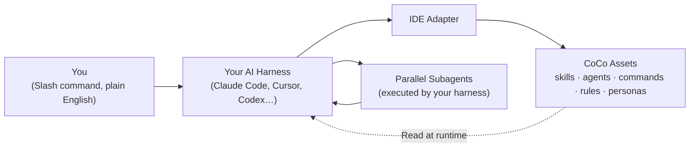

<div align="center">

<br>

<picture>
  <source media="(prefers-color-scheme: dark)" srcset="assets/logo-si.svg">
  
</picture>

# CoCo Super Intelligence

### Summon an advisory board of 389 world-class minds — right inside your AI coding session.

CoCo Super Intelligence is the orchestration layer that turns Claude Code, Cursor, or Codex into an entire engineering department: routed expert panels that deliberate and decide, then **147 skills**, **277 commands**, and disk-persistent state that ship what they decided.

Free · MIT · installs in 90 seconds · 100% local · no telemetry

<br>

[](https://opensource.org/license/mit)
[](CHANGELOG.md)
[](skills/)
[](commands/)
[](systems/superintelligence/)
[](https://github.com/coco-research/coco/actions)

<br>

<p>
&nbsp;&nbsp;<a href="#install"><kbd> &nbsp; Install &nbsp; </kbd></a>&nbsp;&nbsp;
<a href="#the-board"><kbd> &nbsp; The Board &nbsp; </kbd></a>&nbsp;&nbsp;
<a href="#the-framework-underneath"><kbd> &nbsp; Framework &nbsp; </kbd></a>&nbsp;&nbsp;
<a href="#skills-catalog"><kbd> &nbsp; Skills &nbsp; </kbd></a>&nbsp;&nbsp;
<a href="#system-bundles"><kbd> &nbsp; Systems &nbsp; </kbd></a>&nbsp;&nbsp;
<a href="#see-it-run"><kbd> &nbsp; Demos &nbsp; </kbd></a>
</p>

<br>

</div>

<p align="center">
  
</p>

<div align="center"><sub><em>A real <code>/SI-Decide --debate</code> run — CoCo routes an expert panel, deliberates in reacting rounds, and returns an attributed verdict with named dissent.</em></sub></div>

---

<div align="center">

> **One developer writing single prompts? That was last year.**
>
> CoCo Super Intelligence convenes a cross-team board of 389 named experts to pressure-test your hardest calls — then puts an orchestrated team of agents to work executing the verdict: parallel build waves, deterministic verification gates, and phase state that survives every `/clear`.

</div>

<a id="install"></a>

```bash
git clone https://github.com/coco-research/coco.git && cd coco && bash install.sh
```

<div align="center"><sub>90 seconds. That's all it takes to wire CoCo into your AI coding tool.</sub></div>

---

## What CoCo Is (and Isn't)

**CoCo is not a new AI model, and it is not another agent harness.** It doesn't run a model or an agent loop of its own. It's a portable layer of Markdown and YAML that installs *into* the agent harness you already use — Claude Code, Cursor, Codex CLI, or any `AGENTS.md`-compatible tool — and upgrades it with an expert advisory board, a skills library, persistent project memory, specialized subagents, and verification gates.

Your model, your tool, your keys, your machine. When you see "parallel subagent waves," those subagents are executed by your host harness's own agent machinery; CoCo supplies the orchestration structure that makes it all behave like a coordinated team. That is exactly why CoCo is vendor-neutral: it's the operating layer, not the engine.

---

<a id="the-board"></a>

## ⭐ The Board — CoCo Super Intelligence

### A cross-team advisory board of 389 world-class minds

Super Intelligence is CoCo's signature capability. It lets you summon custom, real-world expert panels directly inside your coding session to guide architectural, engineering, risk, finance, and business decisions — each contribution attributed to a named expert, grounded in cited public sources.

```bash
/SI-Decide "Should we migrate our database to pgvector?"
/SI-AI-Decide "Which embedding model gives the best cost/performance?"
/SI-Eng-Pre-Mortem "Review our zero-downtime cache migration strategy"
/SI-GRC-Review "Check this customer onboarding flow for GDPR compliance"
```

**389 expert personas**, organized across 9 specialized departments:

| Department | Experts | Focus |
|---|---:|---|
| **Engineering** | 70 | Software architecture, cloud systems, systems coding, compilers, infrastructure |
| **AI** | 59 | Neural-network research, LLM optimization, safety, alignment, vector databases |
| **Product & Design** | 56 | Design systems, UX, product strategy, growth loops |
| **Finance** | 47 | Valuation, corporate finance, macro modeling, fintech infrastructure |
| **Trading** | 46 | Quant analysis, market microstructure, derivatives pricing, crypto liquidity |
| **Risk & Compliance (GRC)** | 30 | GDPR, HIPAA, SOC 2, security auditing, international regulation |
| **Strategy** | 29 | Platform economics, business models, competitive analysis |
| **Data & Analytics** | 29 | Data engineering, pipeline optimization, predictive modeling |
| **Sales / GTM / Marketing** | 23 | Product-market fit, sales ops, growth marketing, enterprise GTM |

- **242 generated slash commands.** 17 cross-team meta commands (like `/SI-Decide` or `/SI-Tradeoff`, routing across domains) plus 225 per-team commands (25 verbs × 9 teams, such as `/SI-AI-Decide` or `/SI-Eng-Pre-Mortem`). These are generated locally at install time from the team registries — no command files are transmitted or stored remotely.
- **70 expertise cells.** Each department is subdivided into focused cells (e.g. Engineering has 11, AI has 8) so the router can assemble a precise panel rather than a generic crowd.
- **Cross-team meta-orchestration.** For complex queries spanning domains ("build and sell an AI audit tool"), a local router scores your prompt against team registries and cells, then greedily assembles a proportional 16–32-person panel.
- **Citable and grounded.** Every stance is verified from public sources and carries a direct evidence URL. Personas are validated against a strict anti-fabrication gate.
- **`--debate` deliberation.** Panels can argue in reacting rounds before returning a verdict, surfacing named dissent instead of false consensus.

### The selection algorithm (two-stage routing + approval)

The meta-orchestrator uses a staged algorithm so it never has to load the entire persona filesystem at runtime:

1. **Stage A — team & cell routing (cheap).** Reads the meta-registry (`systems/superintelligence/registry.json`) and scans only team descriptions and cell definitions, scoring relevance by keyword and domain overlap to select the top 1–4 teams. If one team dominates, it delegates to that team's own orchestrator.
2. **Stage B — scoped persona selection.** Loads compact persona records (slugs, cells, domains, stances, conflict mappings) for only the selected teams, allocates the 16–32-person budget proportionally, runs the greedy scorer (`0.40·domain + 0.30·cell-coverage + 0.30·conflict-pairing`), and applies a cross-team tension pass to pair opposing viewpoints (e.g. security vs. growth).
3. **Stage C — approval & execution.** Presents the roster grouped by team with a one-line rationale. The action verb then consumes the approved roster and returns output with full line-by-line attribution (e.g. "Aswath Damodaran (Finance): …").

### Persona build & validation pipeline

The 389-persona roster was compiled with a systematic multi-tier workflow. Candidate generation was evaluated across local Qwen (via LM Studio), a hosted small model, and Gemini Flash, but **Claude research agents proved the quality winner** for resolving historical data and citing verifiable signal. Every persona then passes a validation gate (`validate_persona.py`) requiring at least 4 live, non-404 evidence URLs, a valid home team, zero fabricated quotes, and at least 2 verified recent signals (or persistent archetype signals for historical figures).

---

<a id="the-framework-underneath"></a>

## The Framework Underneath

The board decides. The framework ships. Three pillars turn the verdict into merged, verified code.

<table>
<tr>
<td width="33%" valign="top">

### 1. Autonomous team execution
`/team:ship` runs a fully coordinated build pipeline — 6 development stages and 7 hard verification gates. Specialized agents act in their domains (Research, Architecture, Plan, Review, Build, QA). Code must clear the Test Evidence Protocol (independent re-runs, strict coverage, skip-prevention) before a pull request is opened.

</td>
<td width="33%" valign="top">

### 2. Disk-persistent state
AI chat context is fragile and wipes on `/clear`. CoCo persists phase state, decisions, and progress logs to disk across resets, with atomic git commits for every successful step — so you can review history, roll back a bad design path, or resume a long-running migration from any checkpoint.

</td>
<td width="33%" valign="top">

### 3. Vendor-neutral portability
CoCo compiles its rules, templates, and agent definitions into pure Markdown and YAML frontmatter. Native IDE adapters inject the same library into Claude Code, Cursor, Codex CLI, or any `AGENTS.md` tool — so your workflows follow you even if you switch AI editors.

</td>
</tr>
</table>

---

## The CoCo Asset Library

A standard install equips your workspace with a lightweight core; full activation unlocks up to **865 total assets** to orchestrate any software-engineering workflow.

<table align="center">
<tr>
<td align="center" width="20%"><h3>147</h3><sub>Skills</sub><br><small>64 Core + 83 Bundle</small></td>
<td align="center" width="20%"><h3>277</h3><sub>Slash Commands</sub><br><small>35 Core + 242 Bundle</small></td>
<td align="center" width="20%"><h3>34</h3><sub>Specialized Agents</sub><br><small>10 Core + 24 Bundle</small></td>
<td align="center" width="20%"><h3>389</h3><sub>Expert Personas</sub><br><small>Super Intelligence Board</small></td>
<td align="center" width="20%"><h3>15</h3><sub>Cross-IDE Rules</sub><br><small>Cursor MDC Rules</small></td>
</tr>
</table>

<div align="center">
  <sub><strong>Core install:</strong> 124 active assets (64 Skills, 35 Commands, 10 Agents, 15 Rules)</sub><br>
  <sub><strong>Orchestration bundles:</strong> <strong>+68 GSD skills</strong> · <strong>+24 GSD agents</strong> · <strong>+6 Brain skills</strong> · <strong>+9 Super Intelligence skills</strong> · <strong>+242 SI commands</strong> · <strong>3 Workflows</strong></sub>
</div>

---

<a id="skills-catalog"></a>

## Skills Catalog

CoCo ships **147 skills** (64 core + 83 across bundles). These are not prompt snippets — each is a full agent instruction set with state management, verification logic, and error handling. A representative slice by category:

### Visual design & styling
`ui-ux-pro-max` (50 styles, 21 palettes, 50 font pairings, 9 stacks) · `frontend-design` · `design-taste-frontend` · `redesign-existing-projects` · `axiom-liquid-glass` (Apple Liquid Glass, WWDC 2025) · `swiftui-liquid-glass` · `web-design-guidelines` · `tailwind-patterns` (Tailwind v4) · `vercel-react-best-practices` · `clone-website` · `c4-architecture` · `arb-review` · `expo-api-routes` · `ai-product`.

### Engineering discipline & quality
`brainstorming` · `writing-plans` · `executing-plans` · `subagent-driven-development` · `dispatching-parallel-agents` · `test-driven-development` · `systematic-debugging` · `requesting-code-review` · `receiving-code-review` · `verification-before-completion` · `finishing-a-development-branch` · `using-git-worktrees` · `code-verification` (7 bug-vector audit) · `generate-tests` · `api-design-principles` · `cli-anything` · `workflow-routing`.

### AI / LLM engineering
`openai-agents` · `openai-api` · `openai-apps-mcp` · `openai-whisper` · `agent-lightning` (Microsoft Agent Lightning, RL) · `voice-ai` · `ai-marketing-videos`.

### Product management & communication
`prd-generator` · `prd-mastery` · `task-prd-creator` · `project-docs` · `pmstudio` · `nfr-tracker` · `stakeholder-comms` · `meeting-notes` · `change-log`.

### Documents & files
`docx` · `xlsx` · `pdf`.

### Operations, safety & recovery
`dr-plan` (RTO/RPO) · `irp` (incident response) · `recovery-plan`.

### Media, memory & analysis
`coco-ads` (launch videos via HyperFrames) · `media-memory` (multimodal embeddings) · `doc-sync` · `ultra-think` · `browser-automation`.

### The CoCo platform itself
`coco` (conversational router) · `coco-cli` · `skill-creator` · `writing-skills` · `find-skills`.

<details>
<summary><strong>▸ Full catalog — every one of the 147 skills</strong></summary>

<br>

**Core skills (64)**

`agent-lightning` · `ai-marketing-videos` · `ai-product` · `api-design-principles` · `arb-review` · `axiom-liquid-glass` · `brainstorming` · `browser-automation` · `c4-architecture` · `change-log` · `cli-anything` · `clone-website` · `coco` · `coco-ads` · `coco-cli` · `code-verification` · `design-taste-frontend` · `dispatching-parallel-agents` · `doc-sync` · `docx` · `dr-plan` · `executing-plans` · `expo-api-routes` · `find-skills` · `finishing-a-development-branch` · `frontend-design` · `generate-tests` · `irp` · `media-memory` · `meeting-notes` · `nfr-tracker` · `openai-agents` · `openai-api` · `openai-apps-mcp` · `openai-whisper` · `pdf` · `pmstudio` · `prd-generator` · `prd-mastery` · `project-docs` · `receiving-code-review` · `recovery-plan` · `redesign-existing-projects` · `requesting-code-review` · `skill-creator` · `stakeholder-comms` · `subagent-driven-development` · `swiftui-liquid-glass` · `systematic-debugging` · `tailwind-patterns` · `task-prd-creator` · `test-driven-development` · `ui-ux-pro-max` · `ultra-think` · `using-git-worktrees` · `using-superpowers` · `vercel-react-best-practices` · `verification-before-completion` · `voice-ai` · `web-design-guidelines` · `workflow-routing` · `writing-plans` · `writing-skills` · `xlsx`

**GSD bundle skills (68)** — the full `gsd-*` project-orchestration lifecycle: `gsd-new-project`, `gsd-plan-phase`, `gsd-execute-phase`, `gsd-verify-work`, `gsd-autonomous`, `gsd-debug`, `gsd-ui-phase`, `gsd-secure-phase`, `gsd-workstreams`, `gsd-forensics`, `gsd-milestone-summary`, `gsd-map-codebase`, `gsd-profile-user`, and 55 more (see [`systems/gsd/skills/`](systems/gsd/skills/)).

**Brain bundle skills (6)** — `brain` · `brain-init` · `brain-rescan` · `brain-update` · `brain-export` · `brain-wiki`.

**Super Intelligence bundle (9)** — one orchestration skill per built team (ai, engineering, product-design, finance, trading, risk-compliance, strategy, data-analytics, gtm), which generate the 242 `/SI-*` commands at install.

</details>

---

<a id="system-bundles"></a>

## System Bundles

Bundles are opt-in packages that extend the workspace with specialized databases, pipelines, and rosters. Enable them with `--systems <name>`.

### 1. GSD (Get Shit Done)
An orchestration engine of **68 skills and 24 agents** that manages the lifecycle of complex codebases. A disk-backed phase database records goals, decisions, milestones, and blockers; **workstreams** spin up isolated git checkouts to test refactors without polluting main; **forensics** performs post-mortem root-cause audits when a phase fails; and **autonomous mode** runs parallel waves of subagents through plan milestones end-to-end.

### 2. Brain
A local knowledge-graph engine of **6 skills** connecting email, chat, code, and docs. A local SQLite store indexes code entities, business decisions, project terms, and stakeholder feedback; a **wiki generator** builds hyperlinked articles for every recorded entity; and mail sync links project email threads to related files.

### 3. Team
A multi-agent product-team pipeline (`/team:ship`, `/team:plan`, `/team:review`, `/team:verify`, and more). It spawns specialized subagents — Research, Architect, QA — to execute changes, review diffs, and write tests, with deterministic gates that intercept merges to run lints, import audits, reference checks, and verification suites.

### 4. Super Intelligence
The **389-persona advisory board** and its **242 generated `/SI-*` commands** across 9 departments — the hero capability described [above](#the-board).

---

## YOLO Mode: True Autonomy

<table>
<tr>
<td valign="top">

```bash
/coco yolo
```

</td>
<td valign="top">

**Bypass approval gates and let the team run unattended.**<br>
<sub>Activates autonomous multi-stage execution — pipelines advance phase to phase without manual confirmation. Combine with <code>/gsd-autonomous</code> and <code>--systems gsd</code> to run code migrations or test sweeps overnight. Revert to safety any time with <code>/coco careful</code> or <code>/coco normal</code>.</sub>

</td>
</tr>
</table>

---

## Before CoCo vs. After CoCo

<table>
<tr>
<th width="20%">Scenario</th>
<th width="38%">Standard AI Assistant (Claude Code / Cursor / Codex)</th>
<th width="42%">CoCo-Orchestrated Workspace</th>
</tr>
<tr>
<td><strong>Hard decisions</strong></td>
<td>One model's single opinion, no attribution, no dissent.</td>
<td>A routed 16–32-person expert panel deliberates and returns an attributed verdict with named dissent.</td>
</tr>
<tr>
<td><strong>Feature development</strong></td>
<td>Generates a single component, misses side-effects, needs hand-holding.</td>
<td>Scans repo, designs the interface, plans phases, runs parallel build agents, tests, and verifies.</td>
</tr>
<tr>
<td><strong>Code auditing</strong></td>
<td>Suggests basic syntax fixes; misses architectural constraints.</td>
<td>Applies a 7-category audit (TDZ errors, import mismatches, dead code, CSS regressions, mock leaks).</td>
</tr>
<tr>
<td><strong>System debugging</strong></td>
<td>Repeats similar suggestions; loses track of prior attempts.</td>
<td>Systematic loop (Reproduce → Isolate → Hypothesize → Fix → Verify) with saved checkpoints.</td>
</tr>
<tr>
<td><strong>Context resets</strong></td>
<td>Forgets the active plan; starts over from scratch.</td>
<td>Reads workspace state from disk and resumes the active phase immediately.</td>
</tr>
</table>

---

<a id="see-it-run"></a>

## High-Impact Command Demos

<table>
<tr>
<td width="50%" valign="top">

### Cross-team decision
```bash
/SI-Decide --debate "Buy vs. build our vector store"
```
> Routes a proportional expert panel, deliberates in reacting rounds, and returns an attributed verdict with named dissent.

</td>
<td width="50%" valign="top">

### Code-integrity verification
```bash
/code-verification
```
> Audits fresh code against 7 bug vectors, preventing broken references, imports, and mock leakage.

</td>
</tr>
<tr>
<td valign="top">

### Website re-engineering
```bash
/clone-website https://stripe.com
```
> Extracts colors, typography, spacing, shadows, and SVG assets from a live URL into a single-file responsive template.

</td>
<td valign="top">

### Systematic debugging
```bash
/systematic-debugging
```
> Drives a methodical root-cause isolation workflow, preserving hypotheses and findings across API limits.

</td>
</tr>
<tr>
<td valign="top">

### Spec & PRD generation
```bash
/prd-generator
```
> Produces a comprehensive PRD — user stories, metrics, risks, architecture.

</td>
<td valign="top">

### Launch video
```bash
/coco-ads
```
> Turns the project you just shipped into a short, shareable launch video, rendered locally via HyperFrames.

</td>
</tr>
</table>

---

## Power Features

<table>
<tr>
<td width="50%" valign="top">

### CoCo conversational router
```bash
/coco
```
> A central dashboard that routes plain-English asks — "what's blocking?", "summarize files", "run tests" — to the right sub-command.

</td>
<td width="50%" valign="top">

### Multimodal memory
```bash
/media-memory
```
> A local embedding database (Gemini Embedding + ChromaDB) that indexes, searches, and associates diagrams, audio, and docs with your code.

</td>
</tr>
<tr>
<td valign="top">

### Scheduled & loop agents
```bash
# Point your host CLI's scheduler at any CoCo command:
/schedule run /team:review every Monday
/loop 5m /team:verify
```
> CoCo ships no scheduler of its own. Where your host CLI provides scheduling or looping (such as Claude Code's `/schedule` and `/loop`), point it at any CoCo command to run reviews or watches unattended.

</td>
<td valign="top">

### Email triage suite
```bash
/email:summary
/email:today
```
> Reads your active Outlook instance (Legacy AppleScript or New Outlook MIME cache) to fetch, search, thread, and draft replies to project mail.

</td>
</tr>
<tr>
<td valign="top">

### Workspace branching
```bash
/gsd-workstreams create feature-a
/gsd-new-workspace
```
> Branch development workstreams within one repo — isolated, sandboxed checkouts with separate project state.

</td>
<td valign="top">

### AGENTS.md compiler
```bash
bash adapters/codex/install.sh
```
> Compiles all active rules, skills, and command definitions into a standard `AGENTS.md` recognized by Aider, Cline, and Continue.

</td>
</tr>
</table>

---

## How CoCo Works



<div align="center"><sub>CoCo is the asset + orchestration layer. Your harness runs the model and executes the agents.</sub></div>

---

## Installation Matrix

<table>
<tr>
<td width="50%" valign="top">

**Standard 90-second setup**

```bash
git clone https://github.com/coco-research/coco.git
cd coco
bash install.sh
```
*The installer auto-detects your active IDE/CLI.*

</td>
<td width="50%" valign="top">

**Via global npm package**

```bash
# Authenticate the GitHub Packages registry
echo "@coco-research:registry=https://npm.pkg.github.com" >> ~/.npmrc
echo "//npm.pkg.github.com/:_authToken=YOUR_TOKEN" >> ~/.npmrc

# Install and launch
npm install -g @coco-research/coco-cli
coco
```

</td>
</tr>
<tr>
<td valign="top">

**Activate orchestration bundles**

```bash
# Enable GSD, Brain, and Team systems
bash install.sh --systems gsd,brain,team

# Enable the Super Intelligence board
bash install.sh --systems superintelligence
```

</td>
<td valign="top">

**Manual adapter overrides**

```bash
bash install.sh --adapter claude-code
bash install.sh --adapter cursor
bash install.sh --adapter codex
bash install.sh --adapter generic
```

</td>
</tr>
</table>

---

## Staying Current

CoCo tells you when a newer version is available — it checks the GitHub repository at most once per day, prints a one-line banner, and sends **no telemetry**. Disable with `COCO_NO_UPDATE_CHECK=1`.

<table>
<tr>
<td width="50%" valign="top">

**git clones**

```bash
# print version + update status
bash scripts/check-update.sh

# apply an update
git pull --ff-only && bash install.sh
```

</td>
<td width="50%" valign="top">

**npm installs**

```bash
# print version + check for updates
npx @coco-research/coco-cli version

# apply an update
npx @coco-research/coco-cli update
```

</td>
</tr>
</table>

<sub>Releases are tracked in [`CHANGELOG.md`](CHANGELOG.md) and on the <a href="https://github.com/coco-research/coco/releases">GitHub Releases</a> page.</sub>

---

## System Compatibility

<table>
<tr>
<th>AI Tool / CLI</th>
<th>Adapter Name</th>
<th>Status</th>
<th>Details</th>
</tr>
<tr>
<td><strong><a href="https://docs.anthropic.com/en/docs/claude-code">Claude Code</a></strong></td>
<td><code>claude-code</code></td>
<td>Stable</td>
<td>Full support for slash commands, agents, and local settings.</td>
</tr>
<tr>
<td><strong><a href="https://cursor.com/">Cursor</a></strong></td>
<td><code>cursor</code></td>
<td>Stable</td>
<td>Links MDC rules and custom workspace skills.</td>
</tr>
<tr>
<td><strong><a href="https://github.com/openai/codex">Codex CLI</a></strong></td>
<td><code>codex</code></td>
<td>Stable</td>
<td>Compiles assets into root context.</td>
</tr>
<tr>
<td><strong>Aider / Cline / Windsurf</strong></td>
<td><code>generic</code></td>
<td>Stable</td>
<td>Generates a portable, root-level <code>AGENTS.md</code> definition.</td>
</tr>
<tr>
<td><strong>VS Code (Continue)</strong></td>
<td><code>vscode-continue</code></td>
<td>Experimental (stub)</td>
<td>Scaffold only — full wiring tracked in <a href="https://github.com/coco-research/coco/issues/4">#4</a>, targeted for v0.2.</td>
</tr>
<tr>
<td><strong>Antigravity (Google)</strong></td>
<td><code>antigravity</code></td>
<td>Planned</td>
<td>Integration planned for the v0.2 release.</td>
</tr>
</table>

---

## Technical Specifications

<table>
<tr><td><strong>Spec Version</strong></td><td>1.0.0</td></tr>
<tr><td><strong>License</strong></td><td><a href="https://opensource.org/license/mit">MIT</a></td></tr>
<tr><td><strong>Total Skills</strong></td><td>147 with all bundles installed (64 Core + 68 GSD + 6 Brain + 9 Super Intelligence)</td></tr>
<tr><td><strong>Slash Commands</strong></td><td>277 with all bundles — 35 Core (shipped) + 242 Super Intelligence (225 per-team + 17 cross-team, generated at install)</td></tr>
<tr><td><strong>Specialized Agents</strong></td><td>34 (10 Core + 24 GSD Bundle)</td></tr>
<tr><td><strong>Expert Personas</strong></td><td>389 across 9 departments and 70 cells</td></tr>
<tr><td><strong>System Bundles</strong></td><td>4 (GSD, Brain, Team, Super Intelligence) — opt in with <code>--systems &lt;name&gt;</code></td></tr>
<tr><td><strong>Cross-IDE Rules</strong></td><td>15 (.mdc files)</td></tr>
<tr><td><strong>Workflows Defined</strong></td><td>3 (.md pipelines)</td></tr>
<tr><td><strong>Total Addressable Assets</strong></td><td>865 with all bundles enabled</td></tr>
<tr><td><strong>Install Time</strong></td><td>&le; 90 seconds</td></tr>
<tr><td><strong>Telemetry / SaaS</strong></td><td>None — 100% local files</td></tr>
</table>

<sub>Core install ships 64 skills + 35 commands + 10 agents + 15 rules (124 active assets). The totals above reflect a full install with all four bundles (<code>bash install.sh --systems gsd,brain,team,superintelligence</code>). Super Intelligence slash commands are generated locally at install time from the team registries — no command files are transmitted or stored remotely.</sub>

---

## Frequently Asked Questions

<details>
<summary><strong>Is CoCo an AI model or an agent harness?</strong></summary>
Neither. CoCo is a portable layer of Markdown and YAML that installs into the agent harness you already use (Claude Code, Cursor, Codex CLI, or any AGENTS.md tool). Your host harness runs the model and executes the agents; CoCo supplies the skills, commands, agents, rules, and persona board that make it act like a coordinated team.
</details>

<details>
<summary><strong>Is my codebase or data sent to a third party?</strong></summary>
No. CoCo is entirely local — Markdown, configuration, and shell scripts on your machine. Your existing AI tool's privacy policy is unchanged, and CoCo adds no telemetry.
</details>

<details>
<summary><strong>How do I modify or customize a skill?</strong></summary>
Every skill lives at <code>skills/&lt;name&gt;/SKILL.md</code>. Edit it directly to refine instructions or add tools, then run <code>bash install.sh</code> to refresh the symlinks.
</details>

<details>
<summary><strong>How do I cleanly uninstall CoCo?</strong></summary>
Because CoCo uses symbolic links, removal is non-destructive:
<pre>find ~/.claude ~/.cursor -type l -lname "*$(pwd)*" -delete</pre>
This removes only the links pointing back to your CoCo repository folder.
</details>

<details>
<summary><strong>What happens if I switch my AI assistant later?</strong></summary>
Re-run the installer with the new adapter flag (e.g. <code>bash install.sh --adapter cursor</code>). All your custom skills and workflows follow you.
</details>

---

## Contributing & Community

CoCo is MIT-licensed and contributions are welcome.

- **Start here:** [`CONTRIBUTING.md`](CONTRIBUTING.md) — how to add a skill, command, agent, or adapter.
- **Good first issues:** [help wanted / good first issue](https://github.com/coco-research/coco/issues?q=is%3Aissue+is%3Aopen+label%3A%22good+first+issue%22) — small, well-scoped tasks for newcomers.
- **Report a bug / request a feature:** [open an issue](https://github.com/coco-research/coco/issues/new/choose).
- **Security:** see [`SECURITY.md`](SECURITY.md) for responsible disclosure.
- **Conduct:** see [`CODE_OF_CONDUCT.md`](CODE_OF_CONDUCT.md).

Before opening a PR, validate locally — CI runs a frontmatter linter, manifest validation, and an install-script syntax check.

---

## Built On

CoCo Super Intelligence stands on the shoulders of excellent open-source work. Special thanks to:

- **[obra/superpowers](https://github.com/obra/superpowers)** (Jesse Vincent) — the foundational engineering-discipline skills (brainstorming, systematic debugging, TDD, plan writing/execution, git worktrees, code-review flows, verification, and skill authoring).
- **[gsd-build/get-shit-done](https://github.com/gsd-build/get-shit-done)** — the 68-skill / 24-agent GSD project-orchestration bundle.
- **[JCodesMore/ai-website-cloner-template](https://github.com/JCodesMore/ai-website-cloner-template)** — the site-cloning structure behind `clone-website`.
- **[agents.md](https://agents.md/)** community — the vendor-neutral agent-context standard CoCo's adapters follow.
- **[nickwinder/synthteam](https://github.com/nickwinder/synthteam)** (Nick Winder) — the multi-agent debate protocol behind `--debate` deliberation.
- **[latent-spaces/brag](https://github.com/latent-spaces/brag)** (Shunit Haviv) and **[HyperFrames](https://www.npmjs.com/package/hyperframes)** (HeyGen) — the launch-video flow and local render engine behind `coco-ads`.
- **[leonxlnx/taste-skill](https://github.com/leonxlnx/taste-skill)** (Leon) — the design-taste enforcement behind `design-taste-frontend` and `redesign-existing-projects`.
- **[HKUDS/CLI-Anything](https://github.com/HKUDS/CLI-Anything)** — the "wrap any CLI into a structured skill" methodology behind `cli-anything`.
- **[Vercel](https://vercel.com/)** and **[vercel-labs/web-interface-guidelines](https://github.com/vercel-labs/web-interface-guidelines)** — the source material behind `vercel-react-best-practices` and `web-design-guidelines`.

Full attributions — including feature-level inspirations, bundled audio ([ende.app](https://ende.app), [Kenney.nl](https://kenney.nl)), and licenses — live in [CREDITS.md](CREDITS.md). If something influenced CoCo and isn't listed, that's a bug: [open an issue](https://github.com/coco-research/coco/issues/new/choose).
