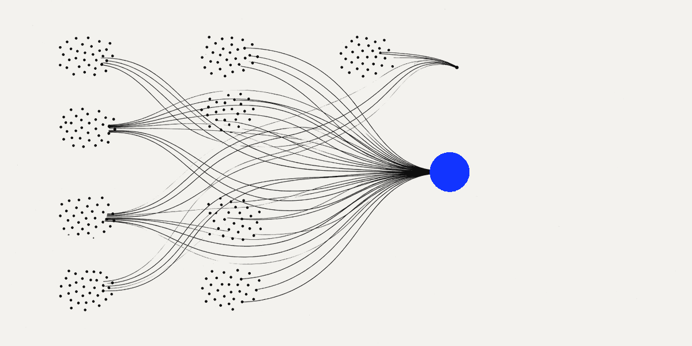
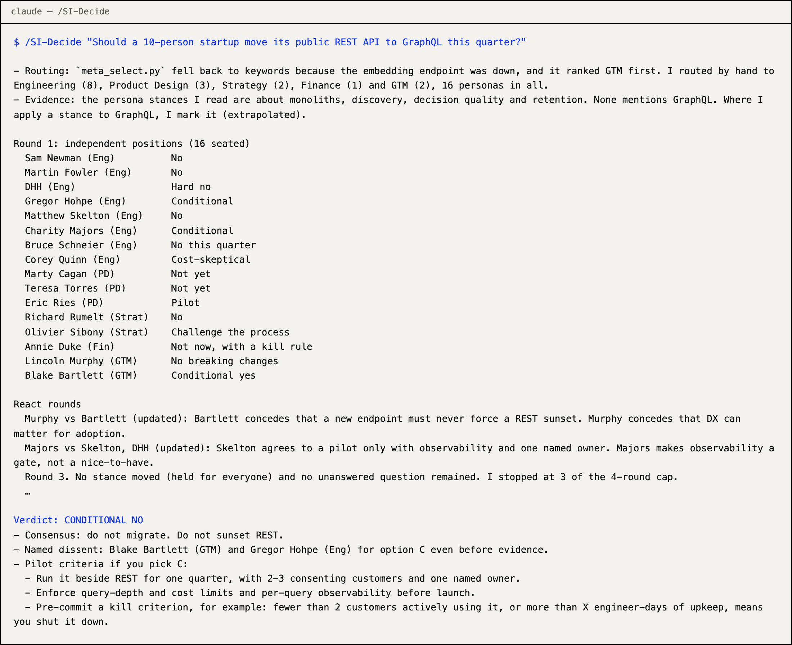
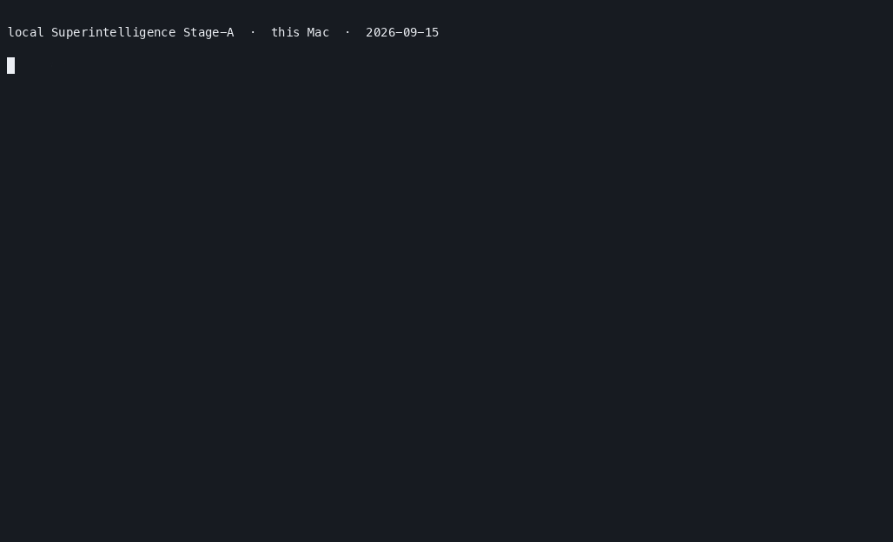
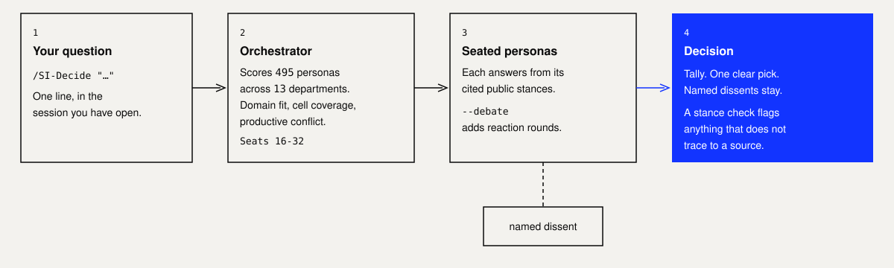

# CoCo Super Intelligence

495 personas across 13 departments, **227 skills**[^installed] and **386 commands** in the full catalog (coco main, 2026-10-05).

<picture>
  <source media="(prefers-color-scheme: dark)" srcset="docs/readme/hero-dark-mode.png">
  
</picture>

[](https://github.com/coco-research/coco/actions/workflows/ci.yml)
[](https://github.com/coco-research/coco/releases)
[](skills/)
[](commands/)
[](systems/superintelligence/)

Open-core: the core is [MIT](LICENSE), and Super Intelligence is [proprietary](systems/superintelligence/LICENSE). Files stay on your machine. No telemetry. A version check may contact GitHub once a day.

## Why it exists

A hard call in a coding session usually gets one model's opinion, with no name on it and no record of who disagreed. CoCo seats a cross-team board of 495 personas, each modeled on the public writing of a named expert, answering from cited public stances, and returns one pick plus the dissent. They are not those people's views or endorsement. The same install carries the skills and commands that do the work after the verdict, and writes phase state to disk so a cleared chat does not erase the plan. It is not a new model and not a new harness. It installs into the one you already run.

## See it

<picture>
  <source media="(prefers-color-scheme: dark)" srcset="docs/readme/si-decide-dark.png">
  
</picture>

*Personas are modeled on the public writing of named experts and are not those people's views or endorsement. See the [persona disclaimer](systems/superintelligence/DISCLAIMER.md). To request removal or correction of a persona, see [docs/personas/TAKEDOWN.md](docs/personas/TAKEDOWN.md).*

An illustration built from a real `/SI-Decide` run (Claude Sonnet 5.5, 30 September 2026, US$0.41). Persona names are replaced with role archetypes and the output is trimmed for length; no other words are changed. The full output, with the same replacements, is in [`docs/readme/terminal/si-decide-full.md`](docs/readme/terminal/si-decide-full.md). Note what it admits: the embedding router was offline, so it fell back to keywords, and stances applied beyond their source are marked *extrapolated*.



*A real `meta_select.py` Stage-A run on this machine. The embedding router was offline (`Connection refused`), so this shows the keyword-fallback routing path (`method: keyword`, `degraded: true`), not embed cosine.*

## Quick start

Prerequisites: git, bash, Node.js 14 or newer (for `npx`), and python3 (it generates the `/SI-*` commands).

`npx cocosuperintelligence` installs the latest release. It clones the pinned release tag (currently `v1.5.0`, not floating `main`) into `./coco` of the current directory, then runs `install.sh`. Run it from your home folder, so the clone is `~/coco` and not a folder inside another project. On a fresh machine it took about 3 minutes, including the download.

```bash
npx cocosuperintelligence
```

Open Claude Code and run:

```bash
/SI-Decide "Should a 10-person startup move its public REST API to GraphQL this quarter?"
```

Newest main, which is ahead of that pin:

```bash
git clone https://github.com/coco-research/coco.git ~/coco && bash ~/coco/install.sh
```

Adapter flags and bundle selection: [`docs/install.md`](docs/install.md).

## What it does

- Get one clear pick on a hard call, with the disagreement named and each stance cited.
- Ask in one line. `/SI-Decide` seats 16-32 of 495 personas across 13 departments. Add `--debate` for reaction rounds.
- Keep going after `/clear`. Decisions, phase state, and progress stay on disk.
- Install into Claude Code, Cursor, Codex, VS Code, or another adapter. Your model and your keys stay yours.
- Carry the verdict into the work: planning, review, verification, PRDs, and a pull request, with gates that have real exit codes.
- Stay local. CoCo adds no analytics. Set `COCO_NO_UPDATE_CHECK=1` to skip the daily GitHub version check.

## How it works

<picture>
  <source media="(prefers-color-scheme: dark)" srcset="docs/readme/how-it-works-dark.svg">
  
</picture>

You type a question. The orchestrator scores 495 personas across 13 departments on domain fit, cell coverage, and productive conflict, then seats 16-32. Each seated persona is modeled on the public writing of a named expert, answers from cited public stances, and is not that person's views or endorsement. `--debate` adds reaction rounds before the tally. The decision is one pick, the dissents are named, and a stance check flags anything that does not trace to a source.

How the router scores teams: [`systems/superintelligence/README.md`](systems/superintelligence/README.md). What each editor actually receives: [`adapters/INDEX.md`](adapters/INDEX.md).

## Status and roadmap

Released: v1.5.0 on npm. Today `npx` installs v1.5.0. That tag already contains the 13 Super Intelligence team skill files, but its installer does not install them as front doors. That fix, and several other installer fixes, are on main.

The measured 189 skills / 386 commands / 34 agents ([`docs/delivered-counts.json`](docs/delivered-counts.json)) apply to main.

Known gap: most GSD skills need the upstream GSD toolkit at `~/.claude/get-shit-done` (see [`systems/gsd/README.md`](systems/gsd/README.md)).

Next three milestones:

1. v1.6.0, so `npx` installs what main already has.
2. Bundle the GSD runtime, so those skills work without a separate toolkit.
3. Installer safety: an uninstall guard, and a clearer clone location.

<details>
<summary><strong>Other install paths, updates, uninstall</strong></summary>

From a checkout you already have, `bash install.sh` auto-detects the editor. Narrow it with `--adapter cursor` or `--systems gsd,brain`. `--core-only` skips bundles. `reverse-skill` stays opt-in: `--systems reverse-skill`.

The remote bootstrap clones the pinned release tag (currently `v1.5.0`, not floating `main`) to `~/.coco`, prints the commit, and waits for you to type `y` before it runs `install.sh`:

```bash
bash <(curl -fsSL https://raw.githubusercontent.com/coco-research/coco/main/bin/coco-bootstrap.sh)
```

`npx cocosuperintelligence update` checks out the pinned release tag. A git clone updates with `git pull --ff-only && bash install.sh`. `bash scripts/check-update.sh` prints the version. The check contacts GitHub at most once a day and sends no telemetry.

Uninstall removes symlinks whose target is this clone, and only those. Run it from the clone root:

```bash
CLONE="$(pwd)"
find ~/.claude ~/.cursor ~/.grok ~/.copilot -type l -lname "${CLONE}/*" -delete
```

A contains-match on the folder name would also delete links into a path that merely contains that name (for example `coco-research` when the clone is `coco`). Hermes profiles live under `~/.hermes/profiles`; use the same `"${CLONE}/*"` prefix there. Uninstall does not remove the generated `SI*.md` command files or the rules block between `<!-- coco:rules-start -->` and `<!-- coco:rules-end -->` in `CLAUDE.md`; delete those by hand.

</details>

## The board

Super Intelligence summons a panel inside the session you already have open. Every contribution is from a persona modeled on the public writing of a named expert and grounded in a cited public source. It is not that person's views or endorsement.

```bash
/SI-Decide "Should we migrate our database to pgvector?"
/SI-AI-Decide "Which embedding model gives the best cost/performance?"
/SI-Eng-Pre-Mortem "Review our zero-downtime cache migration strategy"
/SI-GRC-Review "Check this customer onboarding flow for GDPR compliance"
```

**495 expert personas**, organized across 13 specialized departments:

| Department | Experts | Focus |
|---|---:|---|
| **Engineering** | 70 | Software architecture, cloud systems, systems coding, compilers, infrastructure |
| **AI** | 59 | Neural-network research, LLM optimization, safety, alignment, vector databases |
| **Product & Design** | 56 | Design systems, UX, product strategy, growth loops |
| **Finance** | 47 | Valuation, corporate finance, macro modeling, fintech infrastructure |
| **Trading** | 46 | Quant analysis, market microstructure, derivatives pricing, crypto liquidity |
| **Legal & IP** | 31 | Privacy law, antitrust, patent and copyright policy, digital rights |
| **Risk & Compliance (GRC)** | 30 | GDPR, HIPAA, SOC 2, security auditing, international regulation |
| **Strategy** | 29 | Platform economics, business models, competitive analysis |
| **Data & Analytics** | 29 | Data engineering, pipeline optimization, predictive modeling |
| **Climate & Energy** | 25 | Decarbonization policy, clean-energy economics, carbon markets, circular economy |
| **Education & EdTech** | 25 | Learning science, curriculum design, education policy, assessment |
| **Healthcare & Life Sciences** | 25 | Health economics, genomics, clinical medicine, public health policy |
| **Sales / GTM / Marketing** | 23 | Product-market fit, sales ops, growth marketing, enterprise GTM |

- **342 generated slash commands.** 17 cross-team commands (`/SI-Decide`, `/SI-Tradeoff`) plus 325 per-team commands (25 verbs × 13 teams, such as `/SI-AI-Decide`). Generated on your machine at install time. Nothing is uploaded.
- **98 expertise cells.** Departments are split into cells so the router can seat a precise panel. The count is the sum of the `cells` fields in [`systems/superintelligence/registry.json`](systems/superintelligence/registry.json).
- **Two-stage routing.** Stage A reads the meta-registry and picks the top teams. Stage B loads compact records for those teams only and seats 16-32 people with weights 0.40 domain, 0.30 cell coverage, 0.30 productive conflict, then pairs opposing views. If one team dominates, that team's own orchestrator takes the question.
- **`--debate`.** The panel argues in reacting rounds, then returns a verdict with named dissent instead of a false consensus.

The 495-persona roster was compiled with a systematic multi-tier workflow. Candidate generation was evaluated across local Qwen (via LM Studio), a hosted small model, and Gemini Flash, but **Claude research agents proved the quality winner** for resolving historical data and citing verifiable signal. Personas are checked by an advisory validation gate (`validate_persona.py`) that enforces five things: every required frontmatter field is present; at least 4 cited URLs resolve live (non-404); every `public_stance` carries an `evidence_url`, so no stance is uncited; at least 2 recent signals within 12 months (or 2 persistent signals for historical archetypes); and any `pairs_well_with` / `productive_conflict_with` slug refers to a real roster member. Two limits are worth stating plainly: the gate confirms that a stance is *cited*, not that a quotation is authentic, and `home_team` is only checked for presence, not validated against the list of real teams. A `NEEDS-TOPUP` verdict is advisory. It does not currently affect which personas a council selects at runtime.

## Skills catalog

CoCo ships **227 skills** (75 core + 152 across bundles)[^installed]. Each one is an instruction set with state, checks, and error handling, not a one-line prompt. A slice:

`ui-ux-pro-max` · `frontend-design` · `brainstorming` · `writing-plans` · `test-driven-development` · `systematic-debugging` · `verification-before-completion` · `prd-generator` · `openai-agents` · `coco-loop` · `coco-ads` · `arch-index`

<details>
<summary><strong>▸ Full catalog — every one of the 227 skills</strong></summary>

<br>

**Core skills (75)**

`agent-lightning` · `agent-self-eval` · `ai-marketing-videos` · `ai-product` · `api-design-principles` · `arb-review` · `arch-index` · `axiom-liquid-glass` · `brainstorming` · `browser-automation` · `c4-architecture` · `change-log` · `cli-anything` · `clone-website` · `coco` · `coco-ads` · `coco-cli` · `coco-diagram` · `coco-loop` · `coco-ship` · `code-verification` · `context-budget` · `design-taste-frontend` · `dispatching-parallel-agents` · `doc-sync` · `dr-plan` · `executing-plans` · `expo-api-routes` · `find-skills` · `finishing-a-development-branch` · `frontend-design` · `generate-tests` · `goal` · `humanizer` · `irp` · `journey-map` · `karpathy-guidelines` · `local-llm` · `media-memory` · `meeting-notes` · `nfr-tracker` · `openai-agents` · `openai-api` · `openai-apps-mcp` · `openai-whisper` · `pmstudio` · `prd-generator` · `prd-mastery` · `project-docs` · `receiving-code-review` · `recovery-plan` · `redesign-existing-projects` · `requesting-code-review` · `scroll-world` · `skill-creator` · `skill-evolution` · `stakeholder-comms` · `subagent-driven-development` · `swiftui-liquid-glass` · `systematic-debugging` · `tailwind-patterns` · `task-prd-creator` · `test-driven-development` · `ui-ux-pro-max` · `ultra-think` · `using-git-worktrees` · `using-superpowers` · `vercel-react-best-practices` · `verification-before-completion` · `visual-explainer` · `voice-ai` · `web-design-guidelines` · `workflow-routing` · `writing-plans` · `writing-skills`

**GSD bundle skills (68)** — the full `gsd-*` project-orchestration lifecycle: `gsd-new-project`, `gsd-plan-phase`, `gsd-execute-phase`, `gsd-verify-work`, `gsd-autonomous`, `gsd-debug`, `gsd-ui-phase`, `gsd-secure-phase`, `gsd-workstreams`, `gsd-forensics`, `gsd-milestone-summary`, `gsd-map-codebase`, `gsd-profile-user`, and 55 more (see [`systems/gsd/skills/`](systems/gsd/skills/)).

**Brain bundle skills (6)** — `brain` · `brain-init` · `brain-rescan` · `brain-update` · `brain-export` · `brain-wiki`.

**Super Intelligence bundle (13)** — one orchestration skill per built team (ai, engineering, product-design, finance, trading, risk-compliance, strategy, data-analytics, gtm, climate-energy, education-edtech, healthcare-life-sciences, legal-ip), which generate the 342 `/SI-*` commands at install.

**HyperFrames bundle skills (20)** — `embedded-captions` · `faceless-explainer` · `figma` · `general-video` · `hyperframes` · `hyperframes-animation` · `hyperframes-cli` · `hyperframes-core` · `hyperframes-creative` · `hyperframes-keyframes` · `hyperframes-registry` · `media-use` · `motion-graphics` · `music-to-video` · `pr-to-video` · `product-launch-video` · `remotion-to-hyperframes` · `slideshow` · `talking-head-recut` · `website-to-video`.

**M0 bundle skills (4)** — `m0` · `m0-handoff` · `m0-recall` · `m0-remember`.

**Cognee bundle skills (3)** — `cognee` · `cognee-recall` · `cognee-store`.

**Not installed by default (38):** the `reverse-skill` security pack (33 reverse-engineering and penetration-testing skills, installed only with `--systems reverse-skill`; see [`systems/reverse-skill/`](systems/reverse-skill/)) and 5 Cursor-only skills that ship with the Cursor adapter: `create-rule` · `create-skill` · `create-subagent` · `migrate-to-skills` · `update-cursor-settings`.

</details>

## System bundles

Six bundles install by default. `--core-only` skips them. `--systems <list>` installs an explicit subset. `reverse-skill` is not one of the six: it vendors reverse-engineering and penetration-testing methodology under [`systems/reverse-skill/`](systems/reverse-skill/) and installs only with `--systems reverse-skill`. See [`systems/reverse-skill/README.md`](systems/reverse-skill/README.md).

1. **GSD.** An orchestration engine of **68 skills and 24 agents** for phased work on a large codebase. Most GSD skills also need the upstream GSD toolkit at `~/.claude/get-shit-done/`, which this installer does not yet provide; see [`systems/gsd/README.md`](systems/gsd/README.md). Phase state lives in `.planning/`. Workstreams are isolated git checkouts.
2. **Brain.** A local knowledge-graph engine of **6 skills**. SQLite indexes code entities, decisions, and project terms. The wiki generator writes a page per entity.
3. **Super Intelligence.** The **495-persona advisory board** and its **342 generated `/SI-*` commands** across 13 teams. This is the board [above](#the-board).
4. **HyperFrames.** **20 skills** for video and motion, vendored from HeyGen's `hyperframes` under Apache-2.0.
5. **M0.** **4 skills** for a cross-tool memory thread in one local SQLite file. Python standard library only.
6. **Cognee.** **3 skills** for a local Cognee graph. They fall back to Brain when `cognee server` is not running.

`/team` is not a bundle. It is part of the core install (`/team ship`, `/team plan`, `/team review`, `/team verify`) and needs no flag. `/team ship` runs 6 development stages and 7 verification gates, and it can declare where files should land, then fail if they did not. The check is structural (paths exist), not a judgement that the code does what the component promised. Design adapted from [lak7/devildev](https://github.com/lak7/devildev) (Apache-2.0); no upstream code was copied. See [`CREDITS.md`](CREDITS.md).

## Technical specifications

A default Claude Code install delivers **189 skills, 386 commands and 34 agents**, measured by running the installer. The repository holds 227 skills; the difference is the opt-in security pack and Cursor-only skills. The measured row is main.

The v1.5.0 release `npx` installs today is older. See [Status and roadmap](#status-and-roadmap).

<table align="center">
<tr>
<td align="center" width="20%"><h3>227</h3><sub>Skills</sub><br><small>75 Core + 152 Bundle · 189 install by default</small></td>
<td align="center" width="20%"><h3>386</h3><sub>Slash Commands</sub><br><small>44 Core + 342 Generated</small></td>
<td align="center" width="20%"><h3>34</h3><sub>Specialized Agents</sub><br><small>10 Core + 24 Bundle</small></td>
<td align="center" width="20%"><h3>495</h3><sub>Expert Personas</sub><br><small>Super Intelligence Board</small></td>
<td align="center" width="20%"><h3>15</h3><sub>Cross-IDE Rules</sub><br><small>Cursor MDC Rules</small></td>
</tr>
</table>

<div align="center">
  <sub><strong>Core install:</strong> 144 active assets (75 Skills, 44 Commands, 10 Agents, 15 Rules)</sub><br>
  <sub><strong>A plain install ships every bundle except the security-testing tooling</strong>, which stays opt-in via <code>--systems reverse-skill</code>.</sub><br>
  <sub><strong>Orchestration bundles:</strong> <strong>+68 GSD skills</strong> · <strong>+24 GSD agents</strong> · <strong>+20 HyperFrames skills</strong> · <strong>+13 Super Intelligence skills</strong> · <strong>+342 SI commands</strong> · <strong>+6 Brain skills</strong> · <strong>+4 M0 skills</strong> · <strong>+3 Cognee skills</strong> · <strong>3 Workflows</strong></sub>
</div>

<table>
<tr><td><strong>Spec Version</strong></td><td>1.5.0</td></tr>
<tr><td><strong>License</strong></td><td>Open-core — <a href="LICENSE">MIT</a> core; Super Intelligence is <a href="systems/superintelligence/LICENSE">proprietary</a></td></tr>
<tr><td><strong>Total Skills</strong></td><td>227 in the repository (75 Core + 152 Bundle); 189 install by default on Claude Code</td></tr>
<tr><td><strong>Slash Commands</strong></td><td>386 on a default install — 44 Core (shipped) + 342 Super Intelligence (325 per-team + 17 cross-team, generated at install)</td></tr>
<tr><td><strong>Specialized Agents</strong></td><td>34 (10 Core + 24 Bundle)</td></tr>
<tr><td><strong>Expert Personas</strong></td><td>495 across 13 departments and 98 cells</td></tr>
<tr><td><strong>System Bundles</strong></td><td>6 (GSD, Brain, Cognee, HyperFrames, Super Intelligence, M0) — installed by default. <code>reverse-skill</code>, the security-testing bundle, stays opt-in with <code>--systems reverse-skill</code>. <code>/team</code> is core and needs no flag.</td></tr>
<tr><td><strong>Cross-IDE Rules</strong></td><td>15 (.mdc files)</td></tr>
<tr><td><strong>Workflows Defined</strong></td><td>3 (.md pipelines)</td></tr>
<tr><td><strong>Install Time</strong></td><td>About 3 minutes on a fresh machine, including the download (measured at 189 seconds).</td></tr>
<tr><td><strong>Telemetry / SaaS</strong></td><td>No telemetry, no hosted service. One optional version check against GitHub per day (<code>COCO_NO_UPDATE_CHECK=1</code> turns it off)</td></tr>
</table>

<sub>Core install ships 75 skills + 44 commands + 10 agents + 15 rules (144 active assets). A plain <code>bash install.sh</code> delivers 189 skills, 386 commands and 34 agents on Claude Code: every bundle in the default allow-list (GSD, Brain, Cognee, HyperFrames, Super Intelligence, M0) is installed by default. <code>--core-only</code> installs the core set alone, and <code>--systems &lt;list&gt;</code> installs an explicit subset — including <code>reverse-skill</code>, the security-testing bundle, which stays opt-in and is never part of the default set. Super Intelligence slash commands are generated locally at install time from the team registries — no command files are transmitted or stored remotely. <code>adapters/INDEX.md</code> records what each adapter actually delivers, measured by running it.</sub>

## FAQ

<details>
<summary><strong>Is CoCo an AI model or an agent harness?</strong></summary>

Neither. It is Markdown and YAML that installs into the harness you already use (Claude Code, Cursor, Codex CLI, or any AGENTS.md tool). The host runs the model and the agents. CoCo supplies the skills, commands, agents, rules, and the persona board.
</details>

<details>
<summary><strong>Is my codebase sent anywhere?</strong></summary>

CoCo's files stay on your machine. It adds no telemetry and no hosted service. Your editor's own privacy policy is unchanged. The CLI checks GitHub for a newer version at most once a day. `COCO_NO_UPDATE_CHECK=1` turns that off.
</details>

<details>
<summary><strong>How do I change a skill?</strong></summary>

Edit `skills/&lt;name&gt;/SKILL.md`, then run `bash install.sh` so the symlinks pick up the edit.
</details>

<details>
<summary><strong>What if I switch editors?</strong></summary>

Run `bash install.sh --adapter cursor` (or the adapter you want). The skills and workflows come with you. The full list is [`adapters/INDEX.md`](adapters/INDEX.md).
</details>

## Credits

CoCo stands on other people's work. The short list:

- **[obra/superpowers](https://github.com/obra/superpowers)** (Jesse Vincent) for the engineering-discipline skills: brainstorming, debugging, TDD, plans, worktrees, review, verification, skill authoring.
- **[gsd-build/get-shit-done](https://github.com/gsd-build/get-shit-done)** for the 68-skill / 24-agent GSD bundle.
- **[heygen-com/hyperframes](https://github.com/heygen-com/hyperframes)** (HeyGen, Inc., Apache-2.0) for the 20-skill video bundle under `systems/hyperframes/`.
- **[JCodesMore/ai-website-cloner-template](https://github.com/JCodesMore/ai-website-cloner-template)** for the structure behind `clone-website`.
- **[agents.md](https://agents.md/)** for the vendor-neutral context file the adapters follow.
- **[nickwinder/synthteam](https://github.com/nickwinder/synthteam)** (Nick Winder) for the debate protocol behind `--debate`.
- **[latent-spaces/brag](https://github.com/latent-spaces/brag)** (Shunit Haviv) and **[HyperFrames](https://www.npmjs.com/package/hyperframes)** (HeyGen) for the launch-video flow behind `coco-ads`.
- **[leonxlnx/taste-skill](https://github.com/leonxlnx/taste-skill)** (Leon) for `design-taste-frontend` and `redesign-existing-projects`.
- **[HKUDS/CLI-Anything](https://github.com/HKUDS/CLI-Anything)** for the method behind `cli-anything`.
- **[Vercel](https://vercel.com/)** and **[vercel-labs/web-interface-guidelines](https://github.com/vercel-labs/web-interface-guidelines)** for `vercel-react-best-practices` and `web-design-guidelines`.

Full attributions, including audio ([ende.app](https://ende.app), [Kenney.nl](https://kenney.nl)), are in [`CREDITS.md`](CREDITS.md). If something influenced CoCo and is missing, that is a bug: [open an issue](https://github.com/coco-research/coco/issues/new/choose).

## Contributing

CoCo is open-core: the core is MIT-licensed and contributions are welcome. The Super Intelligence System (`systems/superintelligence/`) is proprietary. See [`systems/superintelligence/LICENSE`](systems/superintelligence/LICENSE).

- Start with [`CONTRIBUTING.md`](CONTRIBUTING.md).
- Good first issues: [help wanted / good first issue](https://github.com/coco-research/coco/issues?q=is%3Aissue+is%3Aopen+label%3A%22good+first+issue%22).
- Bugs and features: [open an issue](https://github.com/coco-research/coco/issues/new/choose).
- Security: [`SECURITY.md`](SECURITY.md). Conduct: [`CODE_OF_CONDUCT.md`](CODE_OF_CONDUCT.md).

Releases are in [`CHANGELOG.md`](CHANGELOG.md) and on the [GitHub Releases](https://github.com/coco-research/coco/releases) page.

## Licence

Open-core. The core of this repository is MIT, in [`LICENSE`](LICENSE). Super Intelligence (`systems/superintelligence/`) is proprietary, in [`systems/superintelligence/LICENSE`](systems/superintelligence/LICENSE). Third-party bundles keep their own licences: HyperFrames is Apache-2.0, and `reverse-skill` documents its upstream licence in its own README.

[^installed]: 189 of the 227 skills install by default on Claude Code, together with all 386 commands and 34 agents. The other 38 are the opt-in `reverse-skill` security pack (33, installed only with `--systems reverse-skill`) and 5 Cursor-only skills. Measured by running the installer, not by counting files: see [`docs/delivered-counts.json`](docs/delivered-counts.json), and [`adapters/INDEX.md`](adapters/INDEX.md) for every other IDE.
